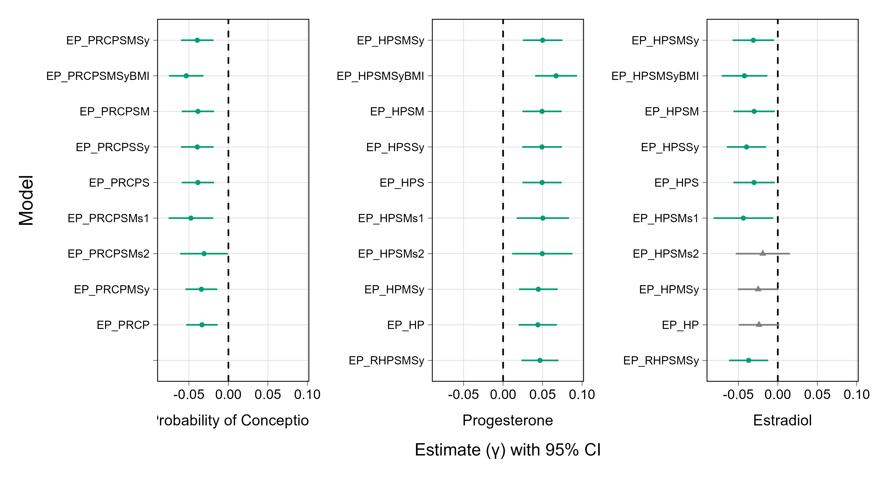

```{r}
#| echo: false
#| results: false

rm(list = ls())

# load in my file to easily link all of the relevant model image 
image_links <- readRDS("../../output/psa_data_appendix_output/qmd_png_file_links.rds")
#image_links

#source in my model lists to have selection vectors 
source("part_sex_attract_model_list.R")

#source in the unique helper function for printing models 
source("../../../../collab_chest/helper_functions.R")


```
### Robustness analyses. 
We report our primary preregistered analyses in text, and report the full model information below (see section 3.1). But we ran additional analyses using simplifications (e.g., ones dropping Study effects, as few interactions emerged, and between-woman hormone effects, which are orthogonal to effects of interest) and alternative treatments (e.g., ones using raw rather than log-transformed hormone levels). We also selected on one variable we did not use as an inclusion criterion but the BioCycle did (BMI between 18 and 35). And we ran analyses on Study 1 and Study 2 separately. We report these results in SOM, S3.2. 

*Simplified analyses dropping Study effects.* Study had few interactions (see below). Simplified analyses dropped all interactions with Study.  

*Simplified analyses dropping between-woman Conception Probability and between-woman Estradiol and Progesterone effects.* Variability in imputed between-woman Conception Probability and between-woman hormone levels should be minimal (as all women participated across a month). Their interactions are orthogonal to those involving within-woman Conception Probability and hormone levels. In simplified models, we excluded all effects involving between-woman Conception Probability and hormone levels.  

*Simplified analyses dropping both Study effects and between-woman Conception Probability and between-woman Estradiol and Progesterone effects.* In yet additional simplified models, we dropped all Study effects and between-woman Conception Probability/hormone effects.  

*Analyses on each study separately.* We ran analyses on Study 1 and Study 2 separately, with all preregistered predictors and interactions aside from Study.   

*Dropping Self Sexual Attractiveness as a control variable.* In our preregistration, we stated that we would also perform analyses dropping Self Sexual Attractiveness as follow-ups. We ran two variants: First, we removed Self Sexual Attractiveness effects and interactions from the full model; second, we removed these effects from a model that also dropped Study effects and between-woman components. 

*Analyses using raw (vs. log-tranformed) hormone levels.* We preregistered log-transformed hormone levels (as justified in Dinh et al., 2022a). For completeness, however, we performed analyses using raw hormone levels. 


The figure below presents effect sizes and confidence intervals for partner sexual attractiveness moderation effects on women’s Extra-Pair Sexual Interest from various models (with full model details displayed below). As can be seen, effects are generally robust across a host of analytic decisions. 


*Note.* Left panel: Probability of Conception × Partner Sexual Attractiveness interaction effects. Center panel: Progesterone × Partner Sexual Attractiveness interaction effects. Right panel: Estradiol × Partner Sexual Attractiveness interaction effects. Point estimates of effect sizes are indicated by a small circle or triangle. Horizontal lines indicate 95% confidence intervals. Green lines with a circle represent 95% confidence intervals that do not include zero effect (i.e., are “significant” at α = .05). Gray lines with a triangle 95% confidence intervals that do include zero effect (i.e., are “non-significant” at α = .05). Models are listed along the left margin of each panel. In the model name, the lead “EP” refers to the outcome, Extra-Pair Sexual Interest. Following the underline dash, “PRC” refers to analyses with Probability of Conception and its interactions entered as predictor; “H” refers to analyses with Progesterone and Estradiol and their interactions entered as predictors. Specific models: 

 

EP_PRCPSMSy, EP_HPSMSy: Full models with both Partner (“P”) and Self (“S”) Sexual Attractiveness, between-woman components of Probability of Conception or hormones (“M”), and Study effects and interactions (“Sy”) modeled.  

EP_PRCPSMSyBMI, EP_HPSMSyBMI: Full models with the sample filtered to participants with BMIs greater than or equal to 18 and less than or equal to 35.

EP_PRCPSM, EP_HPSM: Models that drop Study effects and interactions. 

EP_PRCPSSy, EP_HPSSy: Models that drop between-woman components and interactions. 

EP_PRCPS, EP_HPS: Models that drop both Study effects/interactions and between-woman components/interactions. 

EP_PRCPSMs1, EP_HPSMs1; EP_PRCPSMs2, EP_HPSMs2: Models applied to Study 1 (“s1”) and Study 2 (“s2”) separately; these models include all predictors other than Study effects. 

EP_PRCPMSy, EP_HPMSy: Models that drop Self Sexual Attractiveness effects and interactions. 

EP_PRCP, EP_HP: Models that drop Self Sexual Attractiveness effects/interactions, along with Study effects/interactions and between-woman components/interactions. 

EP_RHPSMSy: A full model that substitutes raw Progesterone and Estradiol levels for log-transformed Progesterone and Estradiol levels. 


```{r}
#| results: 'asis'
#| echo: false

supplemental_sections1 <- list(
  section_1 = list(m = c("EP_PRCPSMSy", "EP_HPSMSy"), #full models
                   title = "Full preregistered models reported in manuscript"),
  section_2 = list(m = c("EP_PRCPSMSyBMI", "EP_HPSMSyBMI"),
                   title = "Primary models with participants with BMIs greater than or equal to 18 and less than or equal to 35"
                   ),
  section_3 = list(m = c("EP_PRCPSM", "EP_HPSM"), #remove study 
                   title = "Removing study terms from full preregistered models"),
  
  section_4 = list(m = c("EP_PRCPSSy", "EP_HPSSy"), #remove between-woman 
                   title = "Removing between-woman terms from full preregistered models"),
  
  section_5 = list(m = c("EP_PRCPS", "EP_HPS"), #remove study and between-woman 
                   title = "Removing both study and between-woman terms from the full preregistered models"),
  
  section_6 = list(m = c("EP_PRCPSMs1", "EP_HPSMs1", #separate study 1 and study 2 models 
                 "EP_PRCPSMs2", "EP_HPSMs2"),
                   title = "Full preregistered models analyzed by study separately"),

  section_7 = list(m = c("EP_PRCPMSy", "EP_HPMSy"), #remove self
                   title = "Removing self sexual attractiveness from full preregistered models"),
  
  section_8 = list(m = c("EP_PRCP", "EP_HP"), #basic model
                   title = "Only including partner sexual attractiveness and its interactions"),
  
  section_9 = list(m = c("EP_RHPSMSy"),#raw hormone analysis with full models 
                   title = "Raw hormone analysis with full models")
  
)

for (i in seq_along(supplemental_sections1)) {

  #extract section name 
  sec_i_name <- names(supplemental_sections1[i])
 
  #extract models 
  models <- supplemental_sections1[[sec_i_name]]$m
  
  #extract title 
  title <- supplemental_sections1[[sec_i_name]]$title
  
  section <- supplemental_sections1[[i]] #grab section 
  models  <- section$m #grab model 
  title   <- section$title #grab title 

  
  
 cat(paste0("\n# Section 3.", i, " ", title, "\n\n"))
  
    for (m in models) {
      cat(paste0("\n## Summary of model: ", m, "\n\n"))
      get_model_imgs(m, image_links, render = TRUE)
      
      # Page break after each model (but skip after the last)
      if (m != tail(models, 1)) cat("\n\n\\newpage\n\n")
    }
  
}


```

